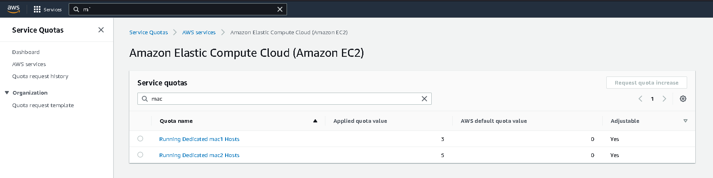

# AWS macOS

Run macOS in AWS for testing out systems macOS compatibility

All done with Terraform and ansible

## How do you know to do this?

Easy! I follow Tony on YouTube 😂

* [How to run mac in the cloud (macOS on AWS)](https://www.youtube.com/watch?v=-lvEK0A142c)
* [How can I access my Amazon EC2 Mac instance through a GUI?](https://repost.aws/knowledge-center/ec2-mac-instance-gui-access)

## Prerequisites

1. You must allow dedicated mac1/mac2 quotas for EC2: 
2. Copy `terraform/terraform.tfvars.example` to `terraform/terraform.tfvars` and adjust as needed

## Create a macOS box accessible via SSH

```shell
cd terraform

# one time
# terraform init

terraform apply
```

Paste the `sshconfig` output into `~/.ssh/config` and then login to the macOS by ssh:

```shell
ssh macos
```

## GUI access

Since most macOS programs are GUI apps, its just about impossible to do all tasks over SSH so we must enable VNC and access via a tunnel. Set this up with Ansible:

```shell
cd ansible

# test connectivity - wait a few mins for host to alive
ansible -m ping all -i hosts.yml

ansible-playbook -i hosts.yml playbooks/vnc.yml
```

Now SSH to the box and open an SSH tunnel:

```shell
ssh -L 5900:localhost:5900 macos

# set a password we need it for VNC
sudo /usr/bin/dscl . -passwd /Users/ec2-user
```

Finally, you can connect via VNC:

* Client software for Linux: [Remmina](https://remmina.org/)
* Server: localhost
* Port: 5900
* Username: ec2-user
* Password: whatever you just set

"Enjoy"!


## What Next?

1. [App setups](./doc/app_setup.md)
2. [Docker with bridge networking](./doc/docker.md)
3. [K3D with with accessible load balancers](./doc/k3d.md)


## Cleanup

* Shutting down EC2 mac instances takes 10 minutes+ - this will fail the terraform script
* Need to "release" the EC2 dedicated host to stop being billed (in 24hr increments)
* Sometimes it take half hour or so for the EC2 host to realize its no longer occupied
* Be patient and re-run terraform after some time or just `release` with the AWS console

```shell
cd terraform
terraform destroy
```
