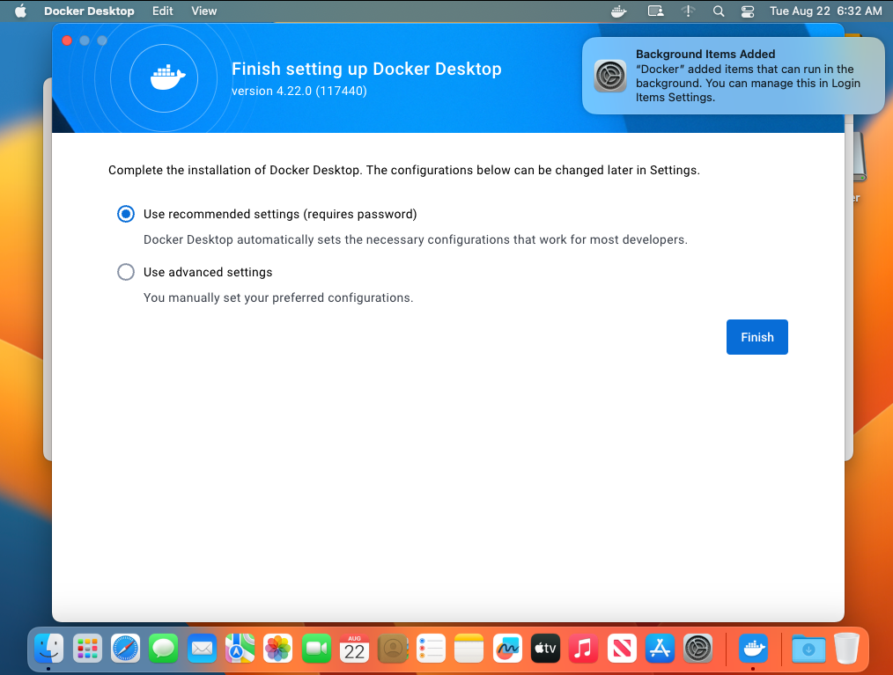
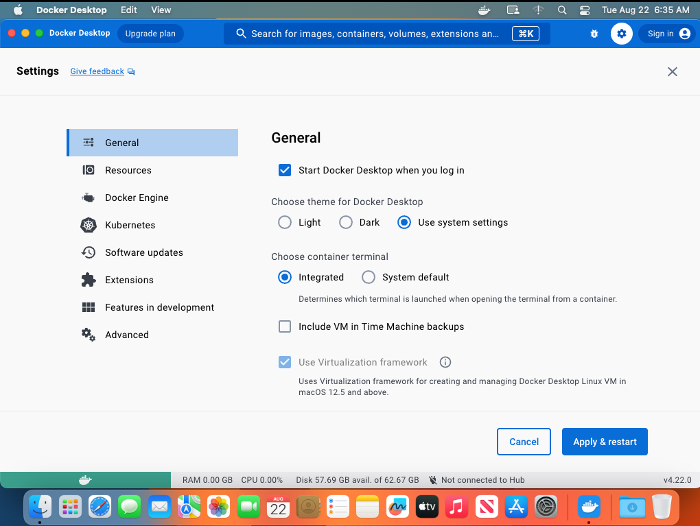
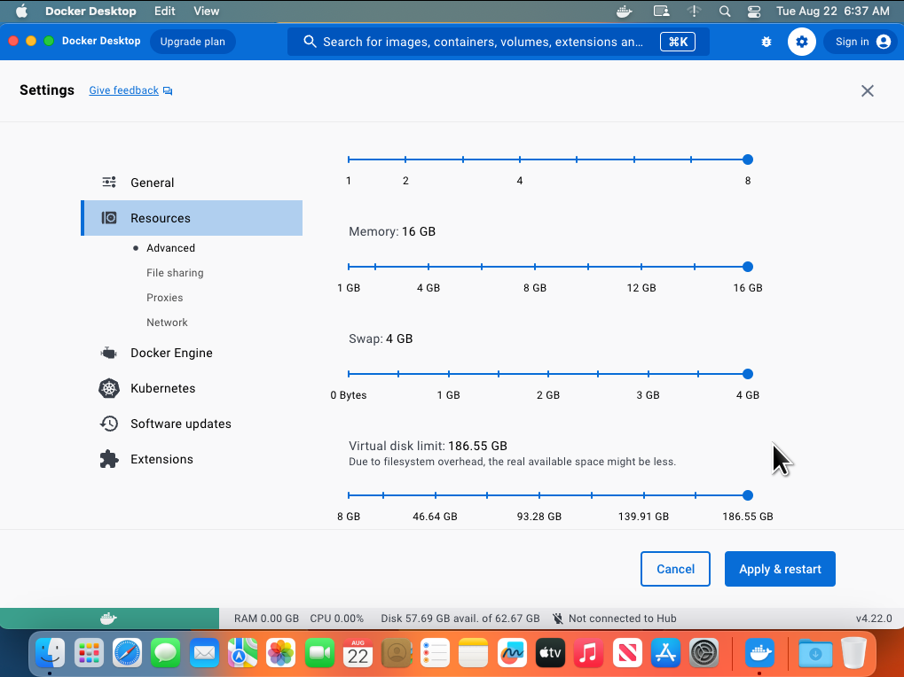

# Docker with bridge networking

How to setup Docker on a mac with bridged networking. macOS users must use Docker since [`podman`](https://podman.io) doesnt work properly on macOS with K3D

## Installation

Instructions: https://docs.docker.com/desktop/install/mac-install/#install-from-the-command-line Instructions for starting Docker from the command line https://github.com/docker/for-mac/issues/6504 dont work (any more?). Install using SSH, then login with VNC to start the daemon.

Manually:

1. Install rosetta: `softwareupdate --install-rosetta`
2. `curl -O "https://desktop.docker.com/mac/main/arm64/Docker.dmg?utm_source=docker&utm_medium=webreferral&utm_campaign=docs-driven-download-mac-arm64"`
3. `sudo hdiutil attach Docker.dmg`
4. `sudo /Volumes/Docker/Docker.app/Contents/MacOS/install --accept-license`

Ansible:

```shell
cd ansible

ansible-playbook -i hosts.yml playbooks/docker.yml
```

## Setup

You have to use the VNC GUI to setup Docker. In finder, double click `Docker`, then walk through the setup:



Login to Docker Desktop (or skip), on `General` screen set Docker to start on login



On `Resources` screen set everything to the max



Click `Apply and Restart`

## Test docker

In the SSH terminal:

```shell
docker run hello-world
```

## macOS <--> container networking

Fixes:

* https://github.com/docker/for-mac/issues/155
* https://github.com/chipmk/docker-mac-net-connect

This is vital to expose the (kubernetes) load balancers to macOS. The driver makes a tunnel into the Docker network and configures macOS networking to route appropriately. The other way to do this is tun-tap but its way more work.

Manually:

1. `brew install chipmk/tap/docker-mac-net-connect`
2. `sudo brew services start chipmk/tap/docker-mac-net-connect` must do as root despite what output of previous command says

Ansible:

```shell
cd ansible

ansible-playbook -i hosts.yml playbooks/docker_networking.yml
```

## Test networking

[Follow these instructions to test docker](https://github.com/chipmk/docker-mac-net-connect#usage)
